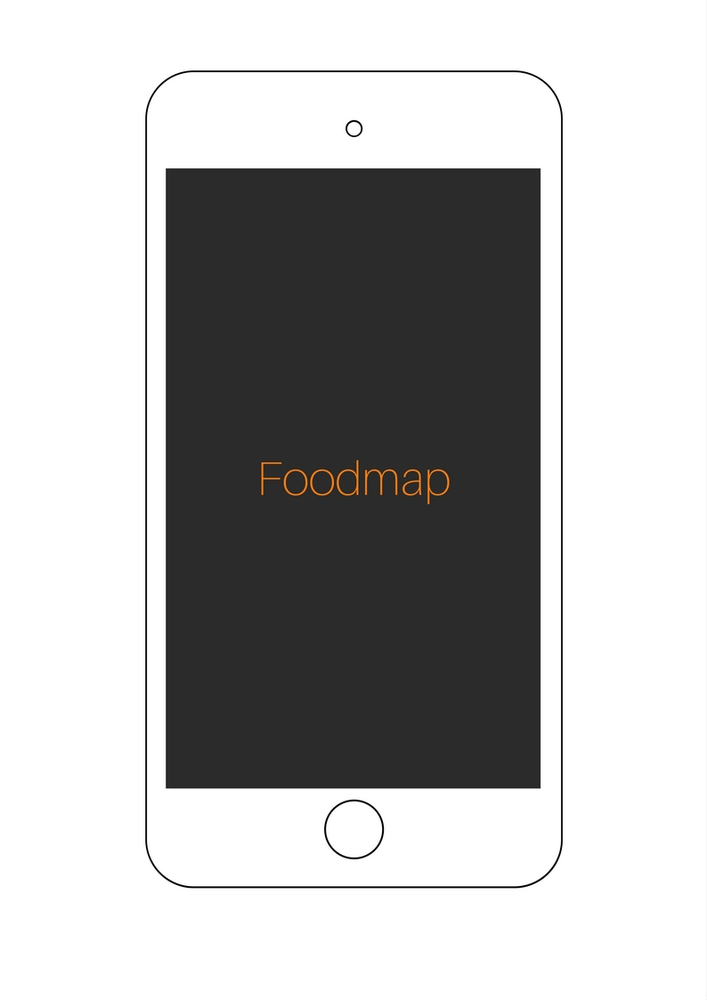

# Foodmap

Objetivo principal

1. Crearemos una web-app.

2.  Vista principal.

 

3. En nuestra segunda vista mostraremos todos los restaurantes cerca y seleccionar

  

4. En nuestra Tercera vista seleccionamos el de preferencia.

      

5. Al seleccionar el restaurantes, mostrarmos la información del restaurante a través de un modal.

    

6. En la ultima vista al cerrar el modal podremos regresar a la vista principal y buscar otra opcion si se necesita.

    

- Entrar ala data
- Filtrar la informacion
- Mostrar la informacion atravez del Modal
- Comprender el funcionamiento de jQuery

## Elaborado para [Laboratoria](http://www.laboratoria.la/)
